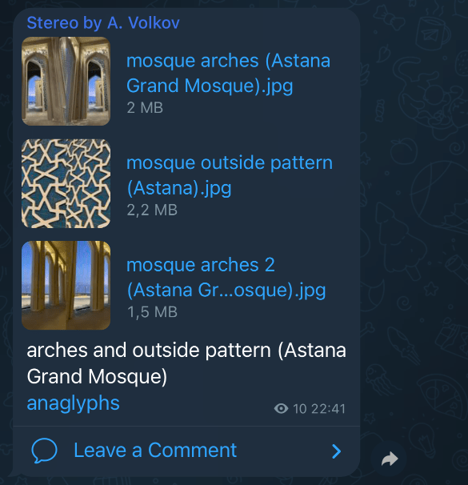
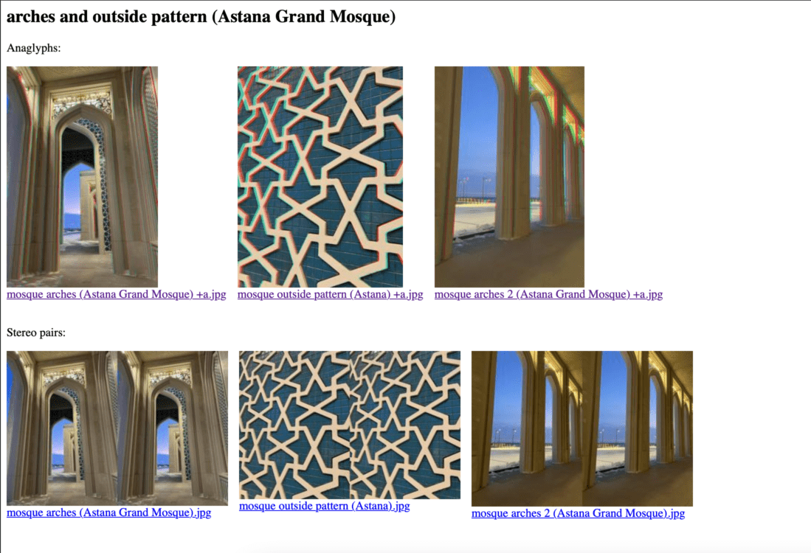

# Stereo Telegram Posts Printing Press

## What is it

It is a tool for creation specific posts for my Telegram [channel](https://t.me/stereobyavolkov) with stereo photos. I post stereo pairs as messages with grouped jpeg files and captions for the last file. It looks like this:

This post have some features:
1. Description under files
2. Link to anaglyphs

Let's consider each feature.

### Description under files

It is matter to post few files in the one post to avoid user annoying due to notifications flood. And this is problem to post it manually. Description can be attached to the first file or be separated from the post. It depends on used Telegram client. This tool solves the problem using bot API of Telegram.

### Link to anaglyphs

I want to attach anaglyphs to each stereo pair. But it is not comfortable watch stereo pairs mixed with non-stereo photos. It forces watcher eyes to defocus every image. So, I attach anaglyphs to page and add link to page to each post. It is routine task that disrupt my art stream. So, this tool creates page by template and uploads it to static hosting. This is example of page for the post above:

## Demo

https://youtu.be/QPzmLHo1Cug

 